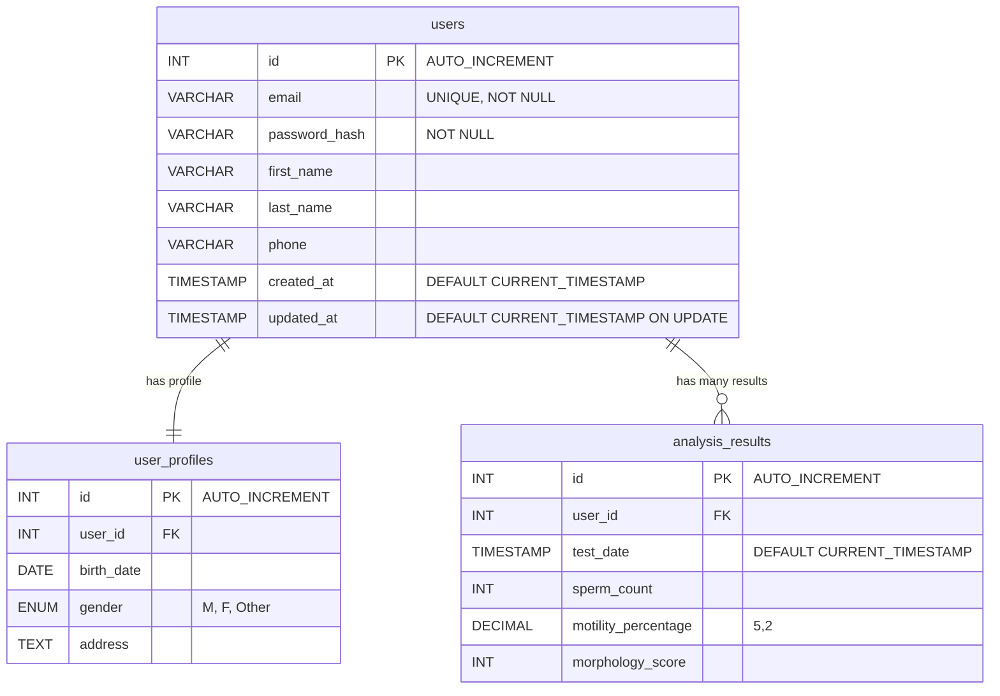

# IDC_2_RDS 마이그레이션 플랜
## 1. 설명
본 프로젝트는 idc 환경에서 구축되어있던 DB를 AWS RDS로 마이그레이션 하는 과정에 대한 과정을 경험해 보기위한 가이드입니다.<br>
Migration에 대한 정보를 기록한 문서는 MIGRATION.md에 작성해두었습니다.<br> 
해당 내용을 수행전에 읽고 진행하시면 이해하는데 있어 많은 도움이 될것이라 확신합니다.

## 2. 전체 파일 구조
전체적인 파일의 구조는 아래와 같습니다.<br>
backups & logs는 폴더 구조에 보이지 않지만 절차에 맞게 실행시 자동으로 생성됩니다.
```text
migration-lab/
├── docker-compose.yml
├── aws_config.sh
├── init-data.sql
├── mysql_env.sh
├── prepare/
│   ├── README.md
│   ├── analyze_db.sh
│   ├── create_dump.sh
│   ├── check_rds.sh
│   ├── rollback_plan.sh          
│   └── rollback/                 
│       ├── rollback_plan.md
│       ├── emergency_rollback.sh
│       ├── full_rollback.sh
│       ├── rollback_test.sh
│       └── rollback_checklist.txt
├── migrationday/
│   ├── README.md
│   ├── maintenance_mode.sh
│   ├── execute_migration.sh
│   ├── nginx.conf.maintenance
│   ├── nginx.conf.normal
│   └── maintenance.html
├── postmigration/
│   ├── README.md
│   ├── verify_migration.sh
│   ├── performance_test.sh
│   ├── setup_monitoring.sh
│   └── cleanup_idc.sh
├── backups/
│   ├── schema_[날짜].sql
│   ├── users_[날짜].sql
│   ├── user_profiles_[날짜].sql
│   ├── analysis_results_[날짜].sql
│   └── checksum_[날짜].md5
└── logs/
    └── migration_log_[날짜].log
```

# 3. 테스트 환경 설명
테스트할 데이터가 없을 경우를 대비하여 테스트를 진행 할 수 있도록 아래의 파일을 준비하였습니다.

## 3.1 파일 설명
테스트 환경구축을 위한 파일들의 설명입니다.<br> 
하단에 추가적으로 이번에 다룰 테스트 데이터의 ERD를 첨부하였습니다.<br>
비교적 간단한 데이터를 마이그레이션하면서 마이그레이션에 대한 절차를 경험해보시는데 중점을 두시길 추천드립니다.<br>
이러한 구조로 되어 있구나 라고 대략적으로 확인 하시고 4번의 작업 순서 & 가이드를 따르시면 됩니다.

- docker-compose.yml
  - 프로제그에 필요한 RDB(MySQL), nginx를 첨부하였습니다.
  - MySQL을 이미 사용하고 있을 경우가 있어 포트는 3303으로 설정하였습니다.
    - 필요시 해당 내용을 편하게 변경해서 사용하시면 됩니다.
- init-data.sql
  - 프로젝트에 필요한 데이터를 생성하는 sql 파일을 첨부하였습니다.
  - 실행시 10만개의 데이터를 생성합니다.
- init-sql.sh
  - init-data.sql을 실행하기 위한 실행 파일입니다.




# 4. 작업 순서 & 가이드
아래의 작업은 프로젝트를 처음부터 어떻게 구성해야할지를 같이 만들어보며 설명을 추가해 두었습니다.<br>
마이그레이션시 각 환경이 다르다보니 각 프로젝트에 맞는 절차를 진행을 위해서는 가이드를 따르며 직접 경험해보는것을 권장합니다.
## 4.1. 프로젝트 디렉토리 생성 및 이동
```bash
mkdir -p migration-lab/{prepare,migrationday,postmigration,backups,logs}
cd migration-lab
```

## 4.2. 롤백 디렉토리 생성
```bash
mkdir -p prepare/rollback
```

## 4.3. 기본 파일 생성 
아래의 파일을 루트 디렉토리에 생성하고 예시 내용을 확인하여 환경에 맞게 작성합니다.<br>
aws_config.sh 파일은 꼭 자신의 aws 환경에 맞게 다시 작성하셔야 합니다.
- aws_config.sh: AWS RDS 정보 설정
- mysql_env.sh: MySQL 패스워드 설정  
- docker-compose.yml: IDC 환경 정의
- init-data.sql: 예시 데이터 생성 SQL

## 4.4. IDC 환경 시작
```bash
docker-compose up -d
sleep 30
```

## 4.5. 예시 데이터 생성 (10만명 데이터 - 몇 분 소요)
```bash
./init-sql.sh  
# 위의 내용 혹은 아래의 내용 둘 중 하나를 실행해 주시면 됩니다.
docker exec -i idc_mysql mysql -uroot -pidcpassword < init-data.sql
```

## 4.7. PREPARE 단계
마이그레이션 단계중 첫번째 단계인 준비 단계 입니다.
해당 단계에서는 아래와 같은 작업을 진행합니다.
- 전체 리소스 현황 분석
  - database 현황분석
  - 애플리케이션 서버 리소스 맵핑
- 마이그레이션 스크립트 개발
  - 회원 데이터 덤프 스크립트 작성
  - 스키마 변환 스크립트 준비
  - 데이터 검증 스크립트 개발
- RollbackPlan 수립
  - 마이그레이션 실패시 롤백 시나리오 정의
  - 이전 시스템 복구 절차 수립
  - 데이터 백업 및 복구 전략 마련

PREPARE 단계 (준비단계)에 대한 자세한 내용은 /prepare/README.md를 확하시면 좀 더 자세한 내용을 작성해 두었습니다.
```bash
chmod +x prepare/*.sh prepare/rollback/*.sh
./prepare/analyze_db.sh           # IDC 데이터베이스 분석
./prepare/check_rds.sh            # AWS RDS 연결 확인
./prepare/create_dump.sh          # 데이터 덤프 생성
```

## 4.4. 롤백 관련 파일 생성 (중요!)
아래와 같은 항목
- rollback_checklist.md
- rollback_plan.md
- rollback_test.sh
- full_rollback.sh
- emergency_rollback.sh

## 4.8. 롤백 계획 검증 및 테스트
```bash
./prepare/rollback_plan.sh        # 롤백 계획 검증
cat prepare/rollback/rollback_plan.md         # 롤백 계획서 검토
cat prepare/rollback/rollback_checklist.txt   # 체크리스트 확인
cd prepare/rollback && ./rollback_test.sh && cd ../..  # 롤백 테스트 실행
```

## 4.9. MIGRATION DAY 단계
```bash
chmod +x migrationday/*.sh
./migrationday/maintenance_mode.sh   # 메인터넌스 모드 활성화
curl http://localhost                # 메인터넌스 페이지 확인
./migrationday/execute_migration.sh  # 실제 마이그레이션 실행
```

## 4.10. POST MIGRATION 단계
```bash
chmod +x postmigration/*.sh
./postmigration/verify_migration.sh    # 데이터 정합성 검증
./postmigration/performance_test.sh    # 성능 비교 테스트
# ./postmigration/setup_monitoring.sh  # CloudWatch 모니터링 (AWS CLI 필요)
```

## 4.11. 14일 후 IDC 리소스 정리
```bash
# ./postmigration/cleanup_idc.sh      # IDC 환경 완전 제거
```

## 4.12. 결과 확인
```bash
echo "마이그레이션 완료!"
echo "로그 파일 확인: ./logs/"
echo "백업 파일 확인: ./backups/"
```
